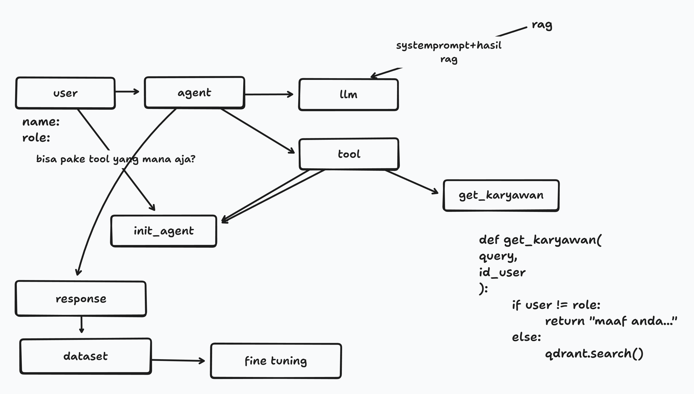

# AGENT HR

Resume Search Agent with FastAPI and Docker.

## Flow



## Local Installation

1. Clone this repository
2. Install dependencies using Poetry:
   ```bash
   poetry install
   ```
3. Set up environment variables in `.env`:
   - `OPENAI_API_KEY`
   - `QDRANT_URL`
   - `QDRANT_API_KEY`
   - `QDRANT_COLLECTION_NAME`
   - `EMBEDDING_MODEL`
   - `LLM_MODEL`

## Running Locally

### Streamlit Simulation
```bash
poetry run streamlit run src/agent_st/simulation.py
```

### FastAPI Server
```bash
poetry run python src/agent_st/server.py
```
The API will be available at `http://localhost:8000`. You can visit `http://localhost:8000/docs` for the interactive API documentation.

## Running with Docker

1. Build the Docker image:
   ```bash
   docker build -t agent-resume .
   ```

2. Run the container:
   ```bash
   docker run -p 8000:8000 --env-file .env agent-resume
   ```

## API Usage

Example `POST` request to `/chat`:

```json
{
  "query": "find HR managers",
  "history": ""
}
```

## Contoh query

1. `find HR managers`
2. `Cari kandidat untuk posisi HR Manager`
3. `Kandidat di Jakarta area`
4. `Bandingkan technical capabilities dari top 3 candidates`